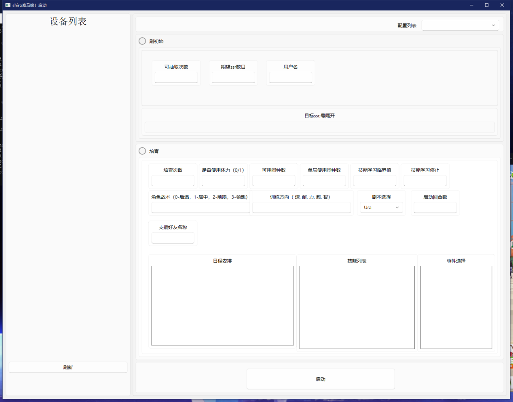

# auto-saimaniang
使用airtest开发的闪耀！优俊少女（赛马娘国服）自动化培育脚本

# 安装
## 方式一  使用打包好的可执行程序运行
1.下载脚本启动器  
下载地址  
链接：https://pan.baidu.com/s/17SK6lGXgfLT_uA6XXlFVYA  
提取码：6666  
2.解压文件后进入sciprt目录下  
3.将saimaniang_init.air文件以及saimaniang_yangma.air文件复制到/script目录中  
**<h3>特别说明，如果只需要养成功能只要复制saimaniang_yangma.air！！不需要复制saimaniang_init.air，防止错误的启用刷初始功能造成删号</h3>**

## 方式二 (不推荐)
运行脚本需要自行修改脚本内的养成参数  
1.安装python3.8或以上版本  
2.执行 pip install airtest  
3.执行 pip insatll cnocr  
4.利用airtest命令执行脚本
airtest框架的运行和开发可以参考[airtest](https://github.com/AirtestProject/Airtest)

# 使用
详细使用查看[脚本使用说明.docx](./脚本使用说明.docx)
